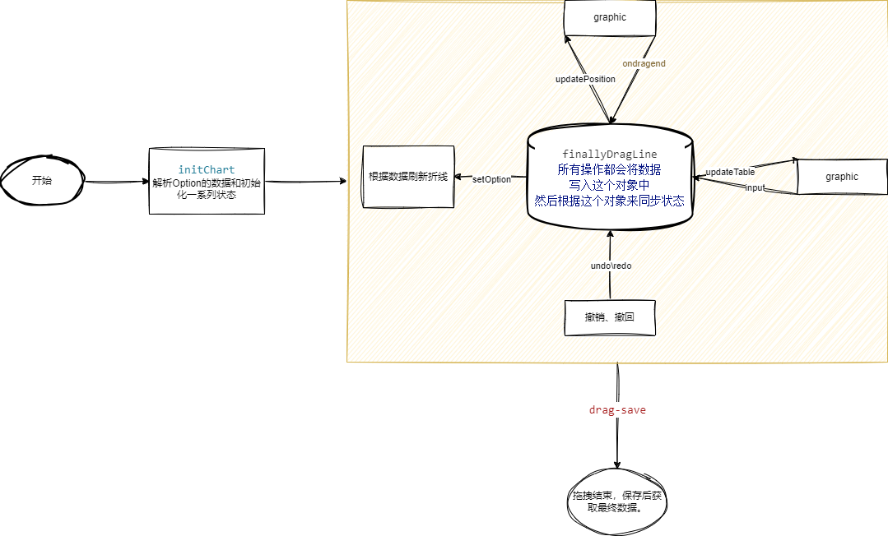

# 拖拽折线图组件说明文档

## 组件名称

`draglinechart`

## 功能概述

该组件基于ECharts库，实现了对折线图中特定数据点的拖拽编辑功能。

1. 支持多种拖拽曲线的方式
   - 单点拖拽：鼠标按住某个数据点，可以拖拽该点的Y值。
   - 范围拖拽：鼠标框选开始结束范围，可以拖拽该范围内的Y值；按住Ctrl键可以选择多个框选范围。
   - 整体拖拽：鼠标按住折线图整体，可以拖拽整体的Y值。
   - 绘制曲线：按照鼠标轨迹绘制曲线。
2. 双击可以切换选中的曲线
3. 有一个表格会对应选中曲线的数据，可以查看曲线的详细信息，实现了双向的编辑。
4. 实现了表格和模态框两种数据展示方式，可以根据需要选择。
5. 实现了撤销和重做操作，可以对编辑过的曲线进行撤销和重做。
6. 支持对折线图中特定数据点的累加功能。
7. 支持对折线图中特定数据点的高亮显示功能。

## 注意事项

1. 只对Echarts1个X轴1个Y轴做了适配。

## 使用说明

1. 使用拖拽功能只需要在Echarts的折线Series中设置 `"yshDrag":true`即可
2. 拖拽折线的值进行累加 只需要设置 `"yshDragSum": true`即可。

## 属性说明

|   属性名   |  类型  | 默认值 |                                                            描述                                                            |
| :--------: | :----: | :----: | :-------------------------------------------------------------------------------------------------------------------------: |
|   option   | Object | `{}` | 完全符合ECharts的option格式，用于定义折线图的基本显示和数据。其中，每个series需要增加一个 `yshDrag`属性来标识是否可拖拽。 |
| dargconfig | Object | `{}` |                       定义组件的行为和显示配置，可以控制是否显示编辑按钮、表格是否在模态框中显示等。                       |

```js
var dargconfig = {
                        showEditButton: true,//是否显示编辑按钮
                        tableInModal: false,//是否以弹窗形式显示表格
                        showCategory: true,//是否显示分类
                        showTable: true,//是否显示表格
                        // categorys: ["range", "all"],//显示的拖拽类型
                    }
```

## 整体结构

[ ECharts 可拖拽点](https://echarts.apache.org/examples/zh/editor.html?c=line-draggable)



## 数据说明

|      数据名      |  类型  |                                                      描述                                                      |
| :---------------: | :-----: | :------------------------------------------------------------------------------------------------------------: |
|      echart      | Object |                                                  ECharts实例                                                  |
|      config      | Object |                                                  组件行为配置                                                  |
|      isEdit      | Boolean |                                                是否处于编辑模式                                                |
|  finallyDragLine  | Object |                              当前拖拽曲线的数据，key为seriesId，value为seriesData                              |
|   dragLineInfo   | Object | 拖拽曲线的信息，key为seriesId，value为{symbolSize:5,symbol:'circle',lineStyle:{type:'dashed',color:'#000000'}} |
|     lightInfo     | Object |                                         高亮信息，记录哪些数据点被高亮                                         |
|       xData       |  Array  |                                                   x轴的数据                                                   |
|     tableData     |  Array  |                                               表格数据显示的数据                                               |
|    tableHeight    | Number |                                                 表格的最大高度                                                 |
|   dragLineList   |  Array  |                                              可拖拽的线路名称列表                                              |
|  currentDragLine  | String |                                              当前被选中的拖拽线路                                              |
|     DRAG_MARK     | String |                                                  `yshDrag`                                                  |
|   DRAG_SUM_MARK   | String |                                                 `yshDragSum`                                                 |
|     dragSumId     | String |                                               求和曲线的seriesId                                               |
|   categoryList   |  Array  |                              分类列表，包括单点拖拽、范围拖拽、整体拖拽、绘制曲线                              |
|  currentCategory  | String |                                               当前选择的拖拽分类                                               |
|   prevCategory   | String |                                              上一次选择的拖拽分类                                              |
|     dradRange     |  Array  |                                                    框选范围                                                    |
|    tableModal    | Boolean |                                            表格是否以模态框形式显示                                            |
|      history      | Object |                              操作历史，记录拖拽结束回调时的diff数据，用于撤销操作                              |
|   historyIndex   | Number |                                                  历史记录指针                                                  |
|    historyList    |  Array  |                                                  历史操作列表                                                  |
|    DRAG_ZLEVEL    | Number |                                                拖拽点的zlevel值                                                |
|      DRAG_Z      | Number |                                                  拖拽点的z值                                                  |
| DRAG_POINT_COLOR | String |                                                  拖拽点的颜色                                                  |
|  SEL_LINE_COLOR  | String |                                                被选中曲线的颜色                                                |
| HIDDEN_DRAG_POINT | Boolean |                                                 拖拽点是否隐藏                                                 |
|     isDrawing     | Boolean |                                              是否处于绘制曲线状态                                              |
|        zr        | Object |                                                ECharts的ZR实例                                                |
|    mouseBuffer    |  Array  |                                                 鼠标移动缓冲区                                                 |
|  prevMouseValue  | Number |                                              上一次鼠标移动时的值                                              |
|    prevMouseX    | Number |                                            上一次鼠标移动时的x轴值                                            |
|  contextmenuDiff  | Number |                                               右键菜单输入框的值                                               |
| currentDataIndexs |  Array  |                                             正在操作的点的索引列表                                             |

## 方法说明

### 初始化相关方法

- `initChart`：初始化ECharts实例、option、zlevel、数据等。
- `initOption`：初始化option，设置x轴和toolbox。
- `initZlevel`：初始化chart的zlevel。
- `initData`：初始化数据，将series中的data复制到finallyDragLine中。
- `initHistory`：初始化历史记录，记录当前曲线的数据。

### 拖拽逻辑相关方法

- `insertSignalDragLine`：根据当前分类插入单点拖拽点。
- `deleteSignalDragLine`：删除单点拖拽点。
- `insertRangeDragLine`：插入范围拖拽点。
- `deleteRangeDragLine`：删除范围拖拽点。
- `insertAllDragLine`：插入整体拖拽点。
- `deleteAllDragLine`：删除整体拖拽点。
- `insertDrawPoint`：插入绘制点。
- `deleteDrawPoint`：删除绘制点。
- `updateDraw`：根据鼠标移动位置更新绘制的数据。
- `interpolation`：进行线性插值，计算鼠标移动中间的数据点。
- `getDragSumData`：获取求和曲线的数据。
- `updateDragSum`：更新求和曲线的数据。
- `dragChange`：当拖拽模式改变时调用，处理不同拖拽模式的切换。
- `setSelLineHigh`：设置选中曲线的高亮状态。
- `changeLine`: 设置高亮和更新表格数据，在编辑状态下调用创建拖拽点的函数。
- `clickEditOrSave`：切换编辑和预览状态，并在保存时触发 `drag-save`事件。
- `toPreview`：切换到预览模式。
- `toEdit`：切换到编辑模式。
- `toSaveAndEmit`：保存数据并触发 `drag-save`事件，然后切换到预览模式。
- `initDragState`：根据当前编辑状态初始化或删除拖拽点。
- `getDragLine`：获取最终拖拽后的曲线数据。
- `clickTableModal`：控制表格是否以模态框形式显示。

### 事件处理相关方法

- `contextmenuClick`：右键菜单点击事件处理。
- `handleKeyDown`：键盘按下事件处理，支持撤销、重做和批量选择。
- `handelKeyUp`：键盘抬起事件处理。
- `handelMouseUp`：鼠标抬起事件处理。
- `clearOverHistory`：清除过期的历史记录，防止历史记录过多。

### 更新相关方法

- `updateChart`：更新图表显示的数据。
- `updatePosition`：更新拖拽点的位置。
- `updateTable`：更新表格显示的数据。
- `updateHistory`：记录当前操作的历史，用于撤销和重做。

### 辅助方法

- `canDrag`：判断series是否可拖拽。
- `isSum`：判断series是否为求和曲线。
- `generateGraphicId`：生成拖拽点的唯一id。
- `getOption`：获取当前ECharts的option。
- `setOption`：设置ECharts的option。
- `emptyLightInfo`：清空高亮信息。
- `listToLineData`：将数值数组转换为带样式的数据数组。
- `lineDataToList`：将带样式的数组转换为数值数组。
- `restoreState`：恢复历史记录中的某个状态。
- `undo`：撤销上一次操作。
- `redo`：重做上一次操作。

## 事件说明

|   事件名   |                     参数                     |                     描述                     |
| :---------: | :-------------------------------------------: | :------------------------------------------: |
| drag-change | `{ finallyDragLine: this.finallyDragLine }` |   当用户拖拽数据后触发，携带最终拖拽数据。   |
|  drag-save  | `{ finallyDragLine: this.finallyDragLine }` | 当用户保存拖拽数据后触发，携带最终拖拽数据。 |

## 模板说明

- 顶部包含编辑按钮和分类选择按钮。
- 中间部分为ECharts图表和数据表格，表格可能以模态框形式显示。
- 右键菜单包含一个输入框和一个确定按钮，用于输入偏移量并保存。
- 模态框包含数据表格，用于显示和编辑数据。
