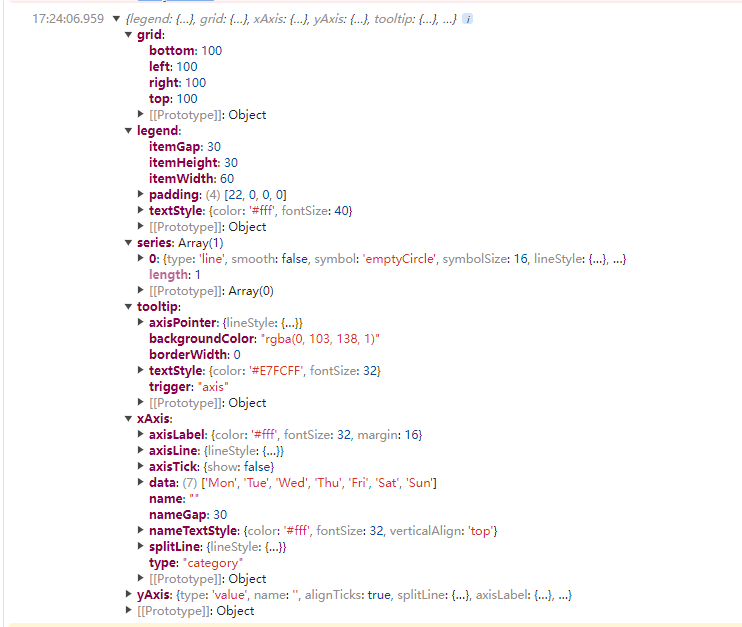

# 问题

项目中常遇见的问题在于，echarts的封装跟不上需求的多变性

# 目标

> 实现最大程度的复用并且提供最大程度的灵活性

# 分析

1、要尽可能简单的使用就要使用尽可能少的配置

2、要有适用性就需要以Echarts的文档为准绳，尽可能的不使用自定义语法

3、对于echarts能实现的功能都应该支持

4、最终获取的都是一份配置项所以可以学习echarts的方法向传入的配置项添加默认值，有自定义的参数就覆盖掉默认值即可

# 实现思路

> 提供一份option模板，将传入的配置和这个模板进行合并,传入的配置如果有值的用自己的，没有的使用模板的。
>
> option.value =配置.value  ? 配置.value : 模板.value

# 实现代码

```js

const GenerateChart = {

    isObject: (obj) => obj !== null && typeof obj === 'object' && !Array.isArray(obj),
    clone: function (obj, map = new WeakMap()) {
        if (Array.isArray(obj)) {
            if (map.has(obj)) return map.get(obj);
            let cloneObj = [];
            map.set(obj, cloneObj);
            for (let i = 0; i < obj.length; i++) {
                cloneObj[i] = this.clone(obj[i], map);
            }
            return cloneObj;
        }
        if (typeof obj === 'function') {
            return obj; // 或者使用其他方法克隆函数
        }
        if (this.isObject(obj)) {
            if (map.has(obj)) return map.get(obj);
            let cloneObj = {};
            map.set(obj, cloneObj);
            for (let k in obj) {
                if (obj.hasOwnProperty(k)) {
                    cloneObj[k] = this.clone(obj[k], map);
                }
            }
            return cloneObj;
        }
        return obj;
    },

    deepMerge: function (target, source, visited = new WeakMap()) {
        for (var key in source) {
            if (source.hasOwnProperty(key)) {
                if (this.isObject(source[key])) {
                    if (visited.has(source[key])) {
                        continue; // 避免循环引用
                    }
                    visited.set(source[key], true);

                    if (!target[key] || !this.isObject(target[key])) {
                        target[key] = {};
                    }
                    this.deepMerge(target[key], source[key], visited);
                } else {
                    target[key] = source[key];
                }
            }
        }
        return target;
    },

    getBaseOption: function (config) {
        if (!this.isObject(config)) {
            console.error("配置必须是对象");
            return this.noDataTemplate;
        }
        var option = this.deepMerge(this.clone(this.baseTemplate), config);
        option.xAxis = this.mergeAxes(option.xAxis);
        option.yAxis = this.mergeAxes(option.yAxis);
        return option;
    },

    mergeAxes: function (axes) {
        if (Array.isArray(axes)) {
            return axes.map(item => this.mergeAxis(item));
        } else {
            return this.mergeAxis(axes);
        }
    },

    mergeAxis: function (item) {
        if (!this.isObject(item)) {
            console.error("坐标轴配置必须是对象");
            return {};
        }
        switch (item.type) {
            case "category":
                return this.deepMerge(this.clone(this.categoryAxisTemplate), item);
            case "value":
                return this.deepMerge(this.clone(this.valueAxisTemplate), item);
            default:
                console.warn("未知的坐标轴类型", item);
                return this.deepMerge(this.clone(this.valueAxisTemplate), item);
        }
    },

    getOption: function (config) {
        var option = this.getBaseOption(config);
        var seriesConfig = option.series;
        var series = [];
        if (!Array.isArray(seriesConfig)) {
            console.error("series配置必须是数组");
            return this.noDataTemplate;
        }
        seriesConfig.forEach(item => {
            var type = item.type || "line";
            var templateKey = this.typeMapTemplate[type];
            if (templateKey) {
                var template = this[templateKey];
                series.push(
                    this.deepMerge(this.clone(template), item)
                );
            } else {
                series.push(item);
            }
        });
        if (series.length === 0) {
            return this.noDataTemplate;
        }
        option.series = series;
        return option;
    },

    baseTemplate: {
        legend: {
            itemWidth: 60,
            itemHeight: 30,
            itemGap: 30,
            textStyle: {
                color: '#fff',
                fontSize: 40,
            },
            padding: [22, 0, 0, 0]
        },
        grid: {
            left: 100,
            right: 100,
            top: 100,
            bottom: 100,
        },
        xAxis: {
            type: 'category',
        },
        yAxis: {
            type: 'value',
        },
        tooltip: {
            trigger: 'axis',
            backgroundColor: 'rgba(0, 103, 138, 1)',
            textStyle: {
                color: '#E7FCFF',
                fontSize: 32,
            },
            borderWidth: 0,
            axisPointer: {
                lineStyle: {
                    color: 'rgb(126,199,255)',
                },
            },
        },
        series: [],
    },

    valueAxisTemplate: {
        type: "value",
        name: "",
        alignTicks: true,
        splitLine: {
            lineStyle: {
                color: '#1E4F79',
                type: 'dashed',
                width: 2,
            },
        },
        axisLabel: {
            color: '#fff',
            fontSize: 32,
            margin: 16,
        },
        axisTick: {
            show: false,
        },
        axisLine: {
            lineStyle: {
                color: '#1E4F79',
                type: 'solid',
                width: 3,
            }
        },
        nameTextStyle: {
            color: '#fff',
            fontSize: 32,
            align: 'right',
        },
        nameGap: 30,
    },

    categoryAxisTemplate: {
        type: "category",
        data: [],
        name: "",
        splitLine: {
            lineStyle: {
                color: '#1E4F79',
                type: 'dashed',
                width: 2,
            },
        },
        axisLabel: {
            color: '#fff',
            fontSize: 32,
            margin: 16,
        },
        axisTick: {
            show: false,
        },
        axisLine: {
            lineStyle: {
                color: '#1E4F79',
                type: 'solid',
                width: 3,
            }
        },
        nameTextStyle: {
            color: '#fff',
            fontSize: 32,
            verticalAlign: 'top',
        },
        nameGap: 30,
    },

    typeMapTemplate: {
        "line": "lineTemplate",
        "bar": "barTemplate",
    },

    lineTemplate: {
        type: "line",
        smooth: false,
        symbol: 'emptyCircle',
        symbolSize: 16,
        lineStyle: {
            width: 4,
        },
    },

    barTemplate: {
        type: "bar",
        barWidth: 32,
    },

    noDataTemplate: {
        graphic: {
            type: 'text',
            left: 'center',
            top: 'center',
            style: {
                text: '暂无数据',
                textAlign: 'center',
                fill: '#999',
                fontSize: 32
            }
        }
    },
};
```

# 示例

> 按照echarts的写法写一个最简单的配置然后通过合并生成完整的option

```js
        // 示例配置
        var config = {
            xAxis: {
                data: ['Mon', 'Tue', 'Wed', 'Thu', 'Fri', 'Sat', 'Sun']
            },
            series: [{
                type: 'line',
                data: [120, 200, 150, 80, 70, 110, 130]
            }]
        };

        // 获取图表配置
        var option = GenerateChart.getOption(config);
        console.log(option);

        // 初始化图表
        var myChart = echarts.init(document.getElementById('main'));
        myChart.setOption(option);


```



# 总结

1. **灵活性高**
   * **模板定制** : 提供了多种图表模板，用户可以根据需要灵活定制和扩展。
   * **深度合并** : `deepMerge` 方法支持深度合并对象，使得配置的组合和覆盖更加灵活。
2. **易于使用**
   * **接口简洁** : echarts的文档就是该工具的文档。
