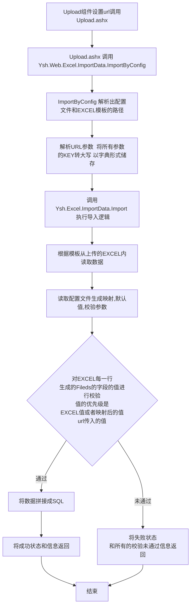

# EXCEL导入数据库说明文档

## 调用示例

### web侧示例

```xml
            <iupload desc="批量导入" style="height:32px;">
                   <sa action="importUrl"></sa>
                   <sa show-upload-list="false">
                       <format>['xls', 'xlsx']</format>
                   </sa>
                   <e>
                       <_bindon-success>
                           <list type="script">
                               <value>
                                   <![CDATA[
                                           if(res.state){
                                               this.$Message.success(res.message);
                                           }else{
                                               alert(res.message);
                                           }
                                   ]]>
                               </value>
                           </list>
                       </_bindon-success>

                   </e>

                   <c>
                       <button value="批量导入" class="pdpBtnDefault mr10"></button>
                   </c>
               </iupload>
```

```js
   this.importUrl = `/conn/ashx/Upload.ashx?do=Ysh.Web.Excel:Ysh.Web.Excel.ImportData.ImportByConfig&template=test_import&config=jb/import:Test&condition=1`;
```

- `template` 是EXCEL模板的名称  目前固定在 /conn/cllfile 文件夹下
- `config` 是EXCEL导入的配置文件节点，参考下方配置文件

### Config示例

参考下方配置文件

### 注意事项：

* Upload.ashx上传文件调用的函数只能传入 `HttpPostedFile` 这一参数，例如：`object o = d.Invoke(upLoadFile);`。
* 使用该功能需要以下几个模块：
  1. 版本 **.NET Framework 4.5.2**
  2. EXCEL模板和按模板填充的数据
  3. 有相关dll及其依赖
  4. 有对应的入库配置文件
  5. 按照正确的规则调用体流程

### 常见错误和解决方法：

* **错误：上传格式不支持**
  解决：确保上传的文件为 `xls`或 `xlsx`格式。
* **错误：文件读取失败**
  解决：确认Excel文件中没有空白的sheet，或字段格式是否正确。

### 整体流程



## EXCEL模板

1. **EXCEL模板规则**
   模板格式应为：`<<<NAME,STR,INC,,G2>>>`
   * **NAME** ：字段名称，建议使用全大写。
2. **注意事项**
   * 模板里面的空白sheet要删除，否则在读取数据时可能会报错。
   * 确保字段名与配置文件中列出的字段一致。

## 相关dll及其依赖

**Ysh.Excel.dll**

> 该DLL处理导入的主题逻辑，包括读取EXCEL模板和数据，按照配置文件拼接数据、执行校验、生成SQL，执行SQL导入。

依赖：

- AjaxPro.2
- FreeGridLib
- ICSharpCode.SharpZipLib, Version=1.3.3.11, Culture=neutral, PublicKeyToken=1b03e6acf1164f73, processorArchitecture=MSIL
- NPOI, Version=2.5.6.0, Culture=neutral, PublicKeyToken=0df73ec7942b34e1, processorArchitecture=MSIL
- NPOI.OOXML, Version=2.5.6.0, Culture=neutral, PublicKeyToken=0df73ec7942b34e1, processorArchitecture=MSIL
- NPOI.OpenXml4Net, Version=2.5.6.0, Culture=neutral, PublicKeyToken=0df73ec7942b34e1, processorArchitecture=MSIL
- PDP2.0
- System
- System.Core
- System.Xml.Linq
- System.Data.DataSetExtensions
- Microsoft.CSharp
- System.Data
- System.Xml
- YshCommon, Version=1.1.22.930, Culture=neutral, processorArchitecture=MSIL

**Ysh.Web.Excel.dll**

> 该DLL用于调用Ysh.Excel.dll的逻辑

依赖:

- Newtonsoft.Json, Version=6.0.0.0, Culture=neutral, PublicKeyToken=30ad4fe6b2a6aeed, processorArchitecture=MSIL
- System
- System.Core
- System.Web
- System.Xml.Linq
- System.Data.DataSetExtensions
- Microsoft.CSharp
- System.Data
- System.Net.Http
- System.Xml

## 配置文件

### 示例

```xml
<?xml version="1.0" encoding="utf-8"?>
<ROOT>
<Test db="JB" idcol="ID" fields="ID,NAME,STATUS,ST_NAME,TYPE_ID,CREATE_TIME">
        <cols remark="默认值应该可以从数据库取,list类型的数据也应该可以从数据库取">
            <NAME desc="设备名称" check="NOT_NULL"></NAME>
            <STATUS desc="设备状态" type="list" sql="STATUS_LIST" check="STATUS"></STATUS>
            <ST_NAME desc="厂站名称" type="def" sql="ST_NAME" check="ST_NAME"></ST_NAME>
            <TYPE_ID desc="设备类型" type="list" sql="TYPE_ID" from="TYPE" check="TYPE_ID"></TYPE_ID>
            <!-- 通过在cols节点下设置def属性来设置默认值保留 -->
            <CREATE_TIME desc="创建时间" def="now" check="CREATE_TIME"></CREATE_TIME>
        </cols>
        <start remark="必须存在该节点,导入之前执行"><![CDATA[]]></start>
        <end remark="必须存在该节点,导入之后执行"><![CDATA[]]></end>
        <update remark="当idcol存在并且传入时必须存在该节点"><![CDATA[UPDATE jb_cgy.test_import SET NAME={1},STATUS={2},ST_NAME={3},TYPE_ID={4} WHERE ID={0}]]></update>
        <insert remark="当idcol不存时必须存在该节点"><![CDATA[INSERT INTO jb_cgy.test_import (NAME,STATUS,ST_NAME,TYPE_ID,CREATE_TIME) VALUES ({1},{2},{3},{4},{5})]]></insert>

        <sqls remark="args的参数必须全大写,list取SQL值的第一列和第二列,取第一行第二行">
            <STATUS_LIST type="sql" db="JB" args="CONDITION" fields="ID,NAME"><![CDATA[SELECT ID,NAME FROM jb_cgy.test_status WHERE COND = {CONDITION}]]></STATUS_LIST>
            <TYPE_ID type="text" datatype="2d" fields="ID,NAME">
                <![CDATA[ 
                1,后台装置
                2,测控装置
                3,交换机
                4,远动机
                5,工作站
                6,保护装置
                ]]>
            </TYPE_ID>
            <ST_NAME type="text" datatype="2d" fields="STATION">
                <![CDATA[
                测试站11
                ]]>
            </ST_NAME>
        </sqls>

        <checks>
            <NOT_NULL>
                <NOTNULL desc="不能为空"></NOTNULL>
            </NOT_NULL>
            <STATUS>
                <NOTNULL desc="不能为空"></NOTNULL>
                <RANGE desc="在0-1之间" min="0" max="1"></RANGE>
            </STATUS>
            <TYPE_ID>
                <NOTNULL desc="不能为空"></NOTNULL>
                <RANGE desc="在1-6之间" min="1" max="6"></RANGE>
            </TYPE_ID>

            <CREATE_TIME>
                <NOTNULL desc="不能为空"></NOTNULL>
                <RANGE type="datetime" desc="创建时间不能小于2024-08-15" min="2024-08-15"></RANGE>
            </CREATE_TIME>
            <ST_NAME >
                <NOTNULL desc="站名称不能为空"></NOTNULL>
                <REGEX desc="站名称长度不能超过10位" pattern="^.{0,10}$"></REGEX>
            </ST_NAME>
        </checks>
    </Test>
</ROOT>
```

### 第一层 根节点

`Test` 节点代表一个EXCEL导入配置

|  属性  | 必填  | 大小写   | 描述                                                                                                                                      |
| :----: | ----- | -------- | ----------------------------------------------------------------------------------------------------------------------------------------- |
|   db   | true  | 必须小写 | 指明EXCEL导入的数据库                                                                                                                     |
| fields | true  | 必须小写 | 要导入数据库的字段，<br />必须为大写因为url传入的参数key被转为大写，<br />导入数据库的字段，<br />插入或更新SQL的参数就是按照fields的顺序 |
| idcol | false | 必须小写 | id字段值必须是EXCEL模板中存在的<br />当 一行的idcol存在并且值不为空则为更新语句否则为插入语句                                             |

### 模块节点

| 名称   | 必填 | 大小写   | 描述                                                                                                         |
| ------ | ---- | -------- | ------------------------------------------------------------------------------------------------------------ |
| cols   | true | 必须小写 | 其子节点对fields字段进行映射、默认值、校验的配置                                                             |
| start  | true | 必须小写 | 第一条执行的SQL,占位符为数字，占位符的顺序为fields，值为对应field的url传入的值                               |
| end    | true | 必须小写 | 最后执行的SQL,占位符为数字，占位符的顺序为fields，值为对应field的url传入的值                                 |
| update | true | 必须小写 | 当idcol存在时执行更新语句,占位符为数字，占位符的顺序为fields,值为对应field查EXCEL，然后查url参数             |
| insert | true | 必须小写 | 当idcol存在时执行插入语句,占位符为数字，占位符的顺序为fields,值为对应field查EXCEL，然后查url参数             |
| sqls   | true | 必须小写 | 服务于cols 设置默认值  或者映射参数                                                                         |
| checks | true | 必须小写 | 服务于cols校验参数，<br />校验时刻为数据执行设置默认值或进行映射后，会遍历整个EXCEL 将所有不合格字段信息返回 |

### 模块节点详解

#### cols子节点

> cols子节点的名称是fields的名称，必须大写

| 属性  | 必填  | 大小写   | 描述                                                                                                                                        |
| ----- | ----- | -------- | ------------------------------------------------------------------------------------------------------------------------------------------- |
| desc  | false | 必须小写 | 描述这一字段，校验的错误信息名称会优先选择desc 没有的话会使用节点名称                                                                       |
| type  | false | 必须小写 | type和sql必须配合使用<br />list  为 映射关系 第一列为 最后的值  第二列为key<br />def 设置默认值                                           |
| sql   | false | 必须小写 | sql的值是sqls子节点的名称 找到对应的节点执行SQL<br />list 对应的SQL必须有两列  第一列为value  第二列为key<br />def 对应的值是第一行第一列 |
| from  | false | 必须小写 | form  和type="list" 配合使用 from的作用是替换映射的key<br />主要用于EXCEL和传入的参数都没有该field 通过一个已存在的字段映射出来            |
| def   | false | 必须小写 | 用于直接设置默认值  如def="1"<br />def标识符<br />def="now"  代表当前时间  是时间类型                                                    |
| check | false | 必须小写 | check的值是checks子节点的名称 找到对应的节点的校验规则                                                                                      |

#### sqls子节点

> sqls  子节点  是load语法  可以执行SQL  也可以写模拟数据
>
> args  只能是通过url传入的参数
>
> args 必须是大写，因为url的参数会被全部转为大写

#### checks子节点

> 每个checks子节点  下面包含一组校验规则
>
> 必须所有规则都通过才合规
>
> desc为当校验不通过时返回错误信息的提示文本
>
> checks子节点 名称不区分大小写  但是推荐统一大写

- `NOTNULL` 表示该字段不能为空

| 属性 | 大小写   | 描述         |
| ---- | -------- | ------------ |
| desc | 必须小写 | 校验规则描述 |

- `RANGE` 表示该字段要满足一定的范围需求

| 属性 | 大小写   | 描述                                                         |
| ---- | -------- | ------------------------------------------------------------ |
| min  | 必须小写 | 最小值                                                       |
| type | 必须小写 | 有 `number`、`datetime`两种类型，不写则默认为 `number` |
| min  | 必须小写 | 值可以和最小值相等 类型要和type 类型一致                     |
| max  | 必须小写 | 值可以和最大值相等 类型要和type 类型一致                     |
| desc | 必须小写 | 校验规则描述                                                 |

- `REGEX` 进行正则匹配

| 属性    | 大小写   | ~~描述~~    |
| ------- | -------- | ------------ |
| pattern | 必须小写 | 正则的规则   |
| desc    | 必须小写 | 校验规则描述 |
